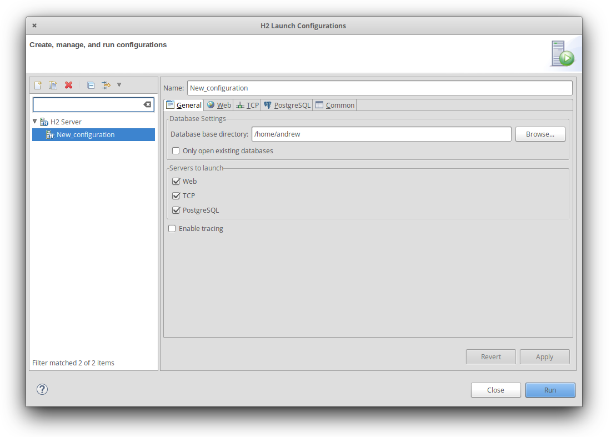
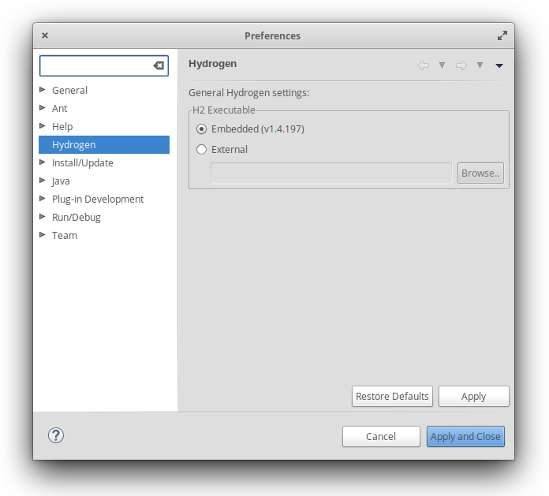

# Hydrogen

[](https://travis-ci.org/avojak/hydrogen) [](https://coveralls.io/github/avojak/hydrogen?branch=master) [](https://opensource.org/licenses/EPL-1.0) 

Hydrogen is an Eclipse plugin to configure and launch one or more [H2](http://www.h2database.com/html/main.html) database servers. Server instances can be launched directly from the Eclipse toolbar.

## Getting Started

These instructions will get you setup to use Hydrogen in your local Eclipse installation.

### Prerequisites

 - Eclipse Oxygen (or later)
 - Java 8+
 
### Building

To build Hydrogen in a development environment, simply use the following Maven command:

```
man clean package
```

An archived Eclipse update site will be generated in the `hydrogen.site` module:

```
hydrogen/hydrogen.site/target/hydrogen.site-${version}.zip
```

### Running the tests

The [JUnit](http://junit.org/junit4/) tests can be run via the following Maven command:

```
mvn clean verify [-Pjacoco]
```

The JaCoCo profile will generate code coverage information if used.

### Eclipse Run Configuration

You will need a Run Configuration to test Hydrogen from within Eclipse during development.

1. Create a new Run Configuration of type Eclipse Application
2. In the Main tab, under Program to Run, select the radio button for "Run an application"
	a. If it is not already selected in the dropdown, select `org.eclipse.ui.ide.workbench`

## Installing

Hydrogen is currently only available from my p2 repository site (https://p2.avojak.com): 

 - [1.0.0-SNAPSHOT](https://p2.avojak.com/content/hydrogen/snapshots/1.0.0-SNAPSHOT)

The latest release will be available at: https://p2.avojak.com/content/hydrogen/releases/latest

### Configuration

To configure the launch configuration, click on the down arrow next to the toolbar icon and select "H2 Launch Configurations..."


From the launch configuration dialog, you can create a new launch configuration, and select which servers you would like to run. Each server can be configured with a specific port number, as well as a few other settings.



### Updating H2

Hydrogen is pre-packaged with the H2 JAR, however it can be easily updated if desired. Open the Eclipse preference dialog, and select Hydrogen from the list on the left. By default, the embedded version is selected, however you can browse to a different JAR on the file system as well.



## Releasing

First, update the following files to drop the `.qualifier` from the version, as they are not automatically updated by the Maven Release Plugin:

* com.avojak.plugin.hydrogen.core/META-INF/MANIFEST.MF
* com.avojak.plugin.hydrogen.feature/feature.xml
* com.avojak.plugin.hydrogen.lib/META-INF/MANIFEST.MF
* com.avojak.plugin.hydrogen.test/META-INF/MANIFEST.MF

Prepare for release:

```console
$ mvn clean release:clean release:preapre -Dusername=<GitHub Username> -Dpassword=<GitHub Token>
```

If the preparation fails, simply rollback with `mvn release:rollback`.

Perform the release:

```console
$ mvn release:perform
```

When prompted, enter the GPG passphrase.

### Post-Release Cleanup

After a successful release, we need to cleanup and prepare for the next development iteration.

Ensure that the local branches are in sync with the remote:

```console
$ git fetch; git pull
```

Update the files mentioned previously to add back the `.qualifier` and update the version accordingly.

## Built With

* [Maven](https://maven.apache.org/) - Dependency Management
* [Travis CI](https://travis-ci.org) - Continuous Integration and Deployment
* [JaCoCo](http://www.eclemma.org/jacoco/) - Code Coverage

## Versioning

I use [SemVer](http://semver.org/) for versioning. For the versions available, see the [tags on this repository](https://github.com/your/project/tags). 

## License

This project is licensed under the Eclipse Public License v1.0 - see the [LICENSE.md](LICENSE.md) file for details.

## Language Support

Currently, only English (US) is supported.

## Error Messages

This is a collection of error messages that you may encounter, and what they mean.

* `Connection is broken: "javax.net.ssl.SSLException: Unrecognized SSL message, plaintext connection?: 10.0.0.9:9092" [90067-193] 90067/90067`

    You will encounter this error message when attempting to connect via the browser console with a JDBC URL that specifies the protocol as SSL, but the TCP server is setup to not use SSL. To fix, either enable SSL on the TCP server, or change the JDBC URL in the browser console to use TCP as the protocol. (See [Issue #2](https://github.com/avojak/hydrogen/issues/2))

* `Connection is broken: "unexpected status 352518912" [90067-193] 90067/90067`

    You will encounter this error message when attempting to connect via the browser console with a JDBC URL that specifies the protocol as TCP, but the TCP server is setup to user SSL. To fix, either disable SSL on the TCP server, or change the JDBC URL in the browser console to use SSL as the protocol. (See [Issue #2](https://github.com/avojak/hydrogen/issues/2))
